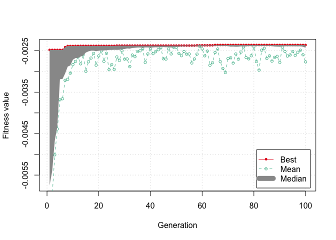
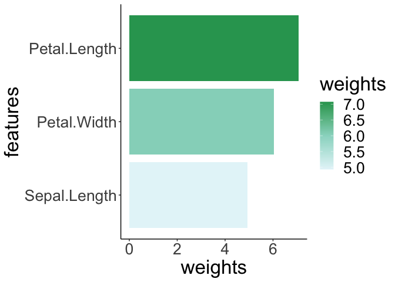
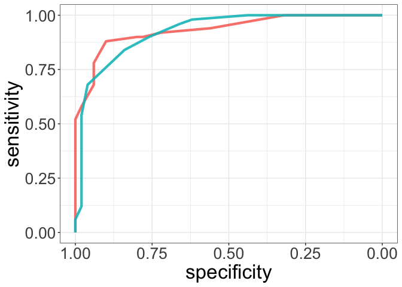

<!-- README.md is generated from README.Rmd. Please edit that file -->

# Clabomic

<!-- badges: start -->

[](https://app.codecov.io/gh/Huaichao2018/Clabomic?branch=main)
[](https://github.com/Huaichao2018/Clabomic/actions)
<!-- badges: end -->

The goal of Clabomic is to help medical researcher to do clinical
laboratory data analysis

## Installation

You can install the development version of Clabomic like so:

``` r
# FILL THIS IN! HOW CAN PEOPLE INSTALL YOUR DEV PACKAGE?
```

## Example

``` r
#install.packages("../Clabomic_0.0.0.9000.tar.gz",
                 #repos=NULL, type="source")
library(Clabomic)
```

``` r
dat=iris
colnames(dat)[ncol(dat)] <- "group"
dat_wilcoxon_res <- do_batch_Wilcoxon(mat = dat)
#> 'data.frame':    4 obs. of  6 variables:
#>  $ W       : num  168 2312 0 0
#>  $ p       : num  8.35e-14 2.14e-13 5.65e-18 2.28e-18
#>  $ mean_x  : num  5.006 3.428 1.462 0.246
#>  $ mean_y  : num  5.94 2.77 4.26 1.33
#>  $ median_x: num  5 3.4 1.5 0.2
#>  $ median_y: num  5.9 2.8 4.35 1.3
```

``` r
datnew=dat
datnew$group=ifelse(datnew$group=='setosa','a','b')
dat_roc_res <- do_batch_roc(datnew)
#> Setting levels: control = a, case = b
#> Setting direction: controls < cases
#> Setting levels: control = a, case = b
#> Setting direction: controls > cases
#> Setting levels: control = a, case = b
#> Setting direction: controls < cases
#> Warning in ci.auc.roc(roc, ...): ci.auc() of a ROC curve with AUC == 1 is always
#> 1-1 and can be misleading.
#> Setting levels: control = a, case = b
#> Setting direction: controls < cases
#> Warning in ci.auc.roc(roc, ...): ci.auc() of a ROC curve with AUC == 1 is always
#> 1-1 and can be misleading.
print(dat_roc_res)
#>               res
#> Sepal.Length 0.96
#> Sepal.Width  0.88
#> Petal.Length 1.00
#> Petal.Width  1.00
```

``` r
res <- do_batch_feature_sel(dat)
#>              attr_importance
#> Sepal.Length       16.120383
#> Sepal.Width         7.872717
#> Petal.Length       47.129616
#> Petal.Width        47.171534
#> [1] 0.9566667
#> [1] 0.9555556
#> [1] 0.9566667
#> [1] 0.9566667
#> [1] 0.9566667
```

``` r
res <- do_ga_based_svm(datnew, positive_col = "a")
#> Scale for colour is already present.
#> Adding another scale for colour, which will replace the existing scale.
```



``` r
datnew$group=as.numeric(ifelse(datnew$group == "a", 1, 0))
best_model <- get_best_svm(datnew,res)
importance <- svm_importance(best_model)
```



``` r
datnew$pre=predict(best_model,datnew)
library(pROC)
#> Type 'citation("pROC")' for a citation.
#> 
#> Attaching package: 'pROC'
#> The following objects are masked from 'package:stats':
#> 
#>     cov, smooth, var
roc <- roc(datnew$group, datnew$pre)
#> Setting levels: control = 0, case = 1
#> Setting direction: controls < cases
cut_mat=cut_off_selecting(roc)
roc.list <- list(Train = roc(dat$group, dat$Sepal.Length), Test = roc(dat$group, dat$Sepal.Width))
#> Warning in roc.default(dat$group, dat$Sepal.Length): 'response' has more than
#> two levels. Consider setting 'levels' explicitly or using 'multiclass.roc'
#> instead
#> Setting levels: control = setosa, case = versicolor
#> Setting direction: controls < cases
#> Warning in roc.default(dat$group, dat$Sepal.Width): 'response' has more than two
#> levels. Consider setting 'levels' explicitly or using 'multiclass.roc' instead
#> Setting levels: control = setosa, case = versicolor
#> Setting direction: controls > cases
do_muti_roc(roc.list)
```


